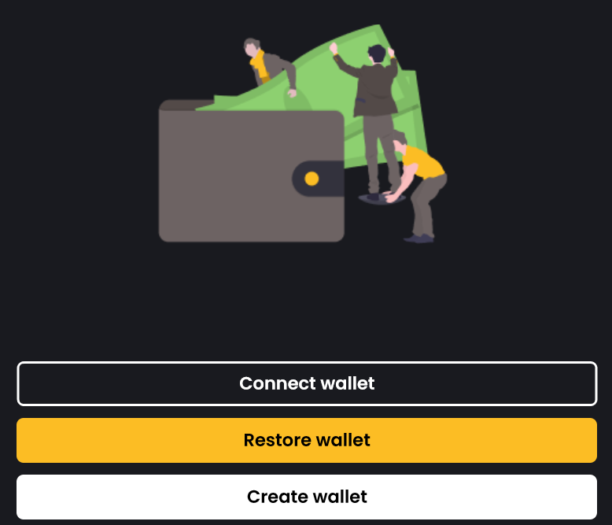
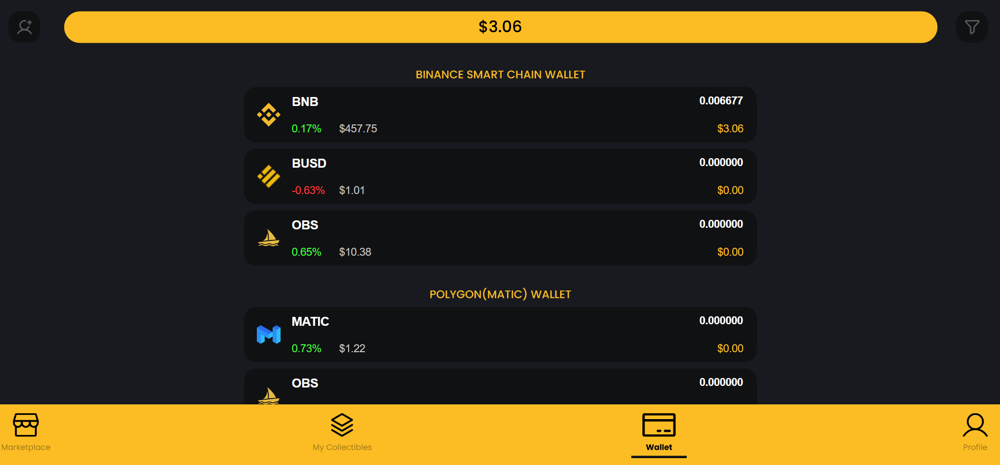

# OpenBiSea Web App

Open Bi Sea Web App is designed to facilitate your auction activity. 

To open the Open Bi Sea Web App, go to the [openbisea.io](https://openbisea.io/) and click **Explore marketplace:**

You can easily explore and participate in all active auctions sorted by the following parameters:

* all
* your own auctions
* featured auctions.

NOTE: To start your work on the Open Bi Sea marketplace, you need first [connect your wallet](#connect-your-wallet). 

## Connect your wallet

To connect your wallet, go to the [Open Bi Sea Web App](https://app.openbisea.com/marketplace) > **Profile**. Then, click **Change or add your wallet**.

Here you have three options to add your wallet:

* [Connect wallet](#connect-wallet)
* [Restore wallet](#restore-wallet)
* [Create wallet](#create-wallet)

### Connect wallet

To connect your wallet, go to the [Open Bi Sea Web App](https://app.openbisea.com/marketplace) > **Profile** > **Change or add your wallet** > **Connect wallet**. 

* The MetaMask (if installed) wallet opens by default. Provide the password to add the wallet. 
* Select QR code: scan QR code with a WalletConnect-compatible wallet.
* Desktop: select the preferred wallet (Ledger Live, Infinity Wallet, Encrypted Inc).

Once you provide wallet credentials, your wallet opens and connects to the Binance Smart Chain automatically.

### Restore wallet

You can restore your wallet using the seed phrase. For this, copy your wallet seed phrase and go to the [Open Bi Sea Web App](https://app.openbisea.com/marketplace) > **Profile** > **Change or add your wallet** > **Restore wallet**. Select 12- or 24-words and click the **Click to paste** button. Once the seed phrase appears in the text fields, click **Submit**.

### Create wallet

To create a new wallet, select 12- or 24-words seed phrase. Please, save this phare. This is the only way to restore your wallet if you lose your credentials. Your MetaMask account is automatically generated. 

 - copy the seed phrase
 - change the seed phrase

Once you have copied and saved your seed phrase, click **Submit**, your wallet is successfully created. It uses $ by default. 

## Mint NFT

## Create an auction

## Manage auction

### Start 
### Stop
### Cancel

