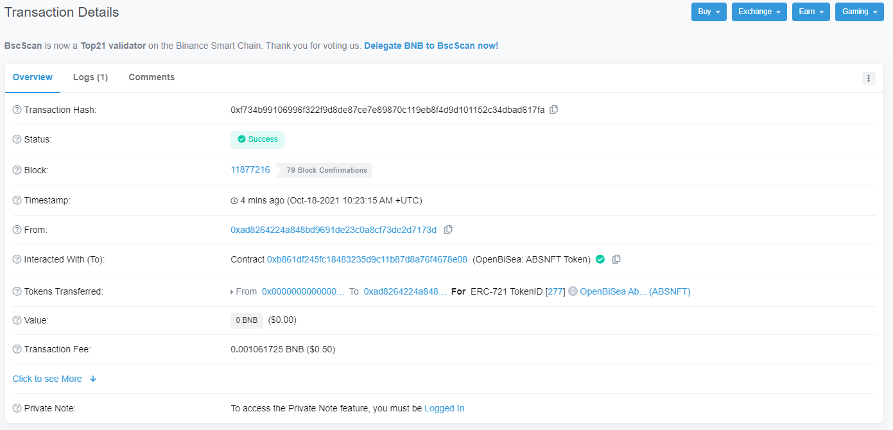

# OpenBiSea Web App

Open Bi Sea Web App is designed to facilitate your NFT auction activity. The Open Bi Sea Web App allows you to create your NFT and start selling it in a few steps. There are **NO** more JSON details or jumping between different websites and platforms. 

To open the Open Bi Sea Web App, go to the [openbisea.io](https://openbisea.io/) and click **Explore marketplace:**

Mobile version: 

NOTE: To work on the Open Bi Sea marketplace, you need first to [connect your wallet](#use-your-wallet).

## Use your wallet

To add your wallet, use the **Connect wallet** button on the main window of the Marketplace.

To change or add another wallet, go to the [Open Bi Sea Web App](https://app.openbisea.com/marketplace) > **Profile**. Then, click **Change or add your wallet**.

You have three options to add your wallet:

* [Connect wallet](#connect-wallet)
* [Restore wallet](#restore-wallet)
* [Create wallet](#create-wallet)

Mobile version: 

### Connect wallet

Use the **Connect wallet** from the menu:

* The MetaMask (if installed) wallet opens by default. Provide the password to add the wallet. 
* Select QR code: scan QR code with a WalletConnect-compatible wallet.
* Desktop: select the preferred wallet (Ledger Live, Infinity Wallet, Encrypted Inc).

Once you provide wallet credentials, your wallet opens and connects to the Binance Smart Chain automatically.

Mobile version: 

### Restore wallet

Use the **Restore wallet** option. Select 12- or 24-words and click the **Click to paste** button. Once the seed phrase appears in the text fields, click **Submit**.

### Create wallet

Use the **Create wallet** option. Select 12- or 24-words seed phrase. Please, save this phare. This is the only way to restore your wallet if you lose your credentials. Your MetaMask account is automatically generated. 

*  - copy the seed phrase
*  - change the seed phrase

Once you have copied and saved your seed phrase, click **Submit**, your wallet is successfully created. It uses $ by default. 

## Work on Marketplace

In the Marketplace, you can easily explore and participate in all active auctions sorted by the following parameters:

* all
* your own auctions
* featured auctions.

To start your auction, you need to [create your NFT](#create-nft) first. If you already have your NFT's created on other platforms, you can [add them to the Open Bi Sea marketplace](#add-existing-nft-to-the-platform). 

* [Create NFT](#create-nft)
* [Start NFT selling or create auction](#start-selling)
* [Manage auction](#manage-auction)
* [Buy NFT](#buy-nft-or-make-a-bid)
* [Add existing NFT](#add-existing-nft-to-the-platform)

### Create NFT

Open **My Collectibles** and click on the plus sign on the top-left.

Mobile version: 

Upload a media file (image or animation), fill in an NFT name, description, specify NFT artist, and add the artist's public profile, if it exists. 

Click **Mint Now**.

Once your media file is uploaded successfully, you'll see the following message:

Click on the NFT address to check the status and details.

Now, your NFT is created, whitelisted, and can be sold. 

Mobile version: 

### Start selling

All NFTs created on the platform or added using the settings menu are available on the Open Bi Sea Marketplace **My Collectibles** tab.

Select an NFT you want to sell and click **Start selling**.

Here, you have to perform the following steps to start the auction:

* Set an initial price in BNB or BUSD. Collectors will see this price and won’t be able to place a bid lower it.
* **Create an auction for a specific period**
  You can set a sufficiently long term for the auction (for example, a month) or pick up the final date from the calendar. All bids will be accepted during this time, and once the time expires, the highest bid wins. The NFT is automatically sold to the collector with the highest bidder.
* **Sell ​​an NFT without bids**
  To sell an NFT to the first collector who offers a price higher than the initial price, select the **Buy now** option. Also, you can set the auction period.

> **Note!** Commission on the NFT sale is 5% 

Mobile version: 

### Manage auction

Once your auction is created, you can see it in the **Marketplace** tab > **My Own**.

Click on the auction you want to manage. The opened form allows you to **cancel** auction and **share** the auction details with others.

* Click **Cancel auction** to remove it from the active auction list. Once your auction is canceled, it becomes available in the **My Collectibles** tab.
* Click **Tell a friend** or use the **Share** icon to share details of your auction with friends via social networks. 

### Buy NFT or make a bid

To buy NFT, go to the **Marketplace** tab, select the NFT you're interested in, and click **Buy** to buy the NFT now or **Bid** to make a bid for the current NFT.

## Add existing NFT to the platform
### Add NFT Contract 

If you already have NFT, you can easily add it to the Open Bi Sea Marketplace. For this, open **My Collectibles**, click on the settings sign on the top-right and select the **Add NFT Contract** option:

1. Specify the contractNFT (address): the NFT contract address (e.g., `0x3ce4e8edd002e653aa07b0b239bf5aa3bafde775`).
2. Select where you want to add the NFT contract. Click on the **Add to ETH list now** or **Add to BSC list now**.

To start selling your NFT, you need to [whitelist the NFT contract](#whitelist-contract).

Mobile version: 

### Whitelist Contract

To whitelist the newly added NFT contract, open **My Collectibles**, click on the settings sign on the top-right and select the **Whitelist Contract** option:

Specify the NFT address contract and click **Allow contract** button.

Now you can start selling your contract on the Open Bi Sea Marketplace.

Mobile version: 

### Invite Friends

To share your NFT contract details with others, use **Invite Friends!** option. Specify people to send them notifications about your NFT contract.

### Perform Tests

You can run some tests in BSC or ETH testnet before start selling on the Open Bi Sea Marketplace. For this, select the testnet from the menu:

Mobile version: 

