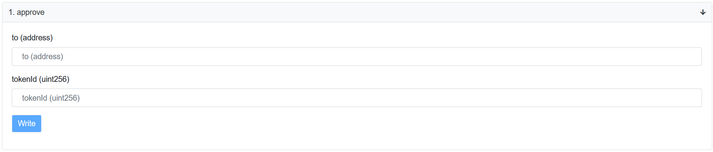
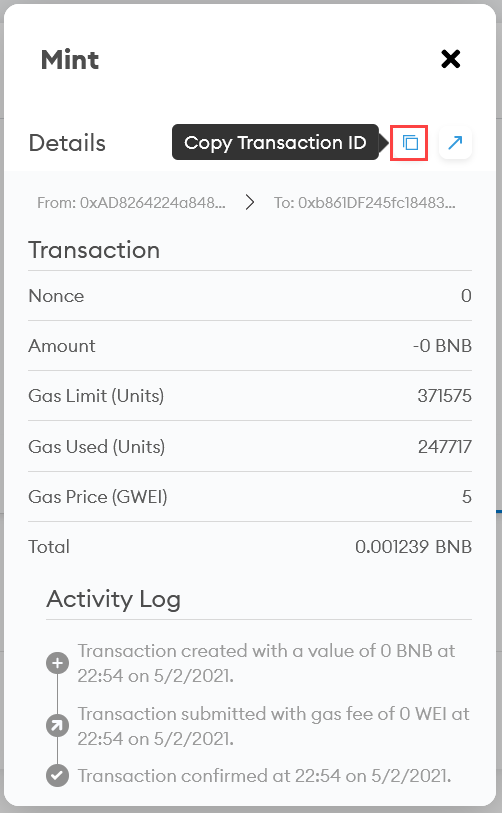
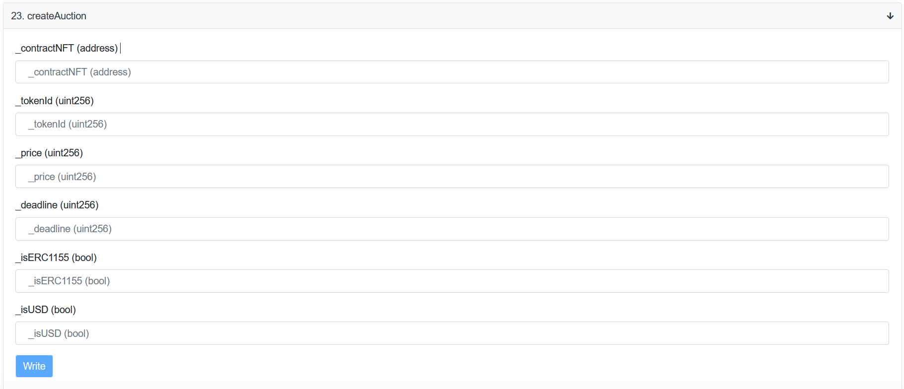
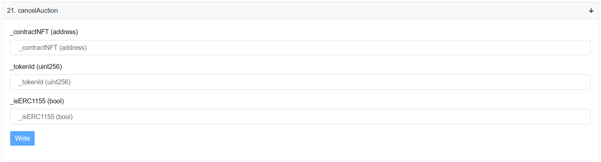

# How To Create an Auction

In this guide, we’ll show you how to list your NFT for auction, how to set an initial price, set up the auction duration.

* [Preconditions](#preconditions)
* [Create Auction](#create-auction)
* [Cancel Auction](#cancel-auction)

## Preconditions

1. To put up an NFT token to auction, you need to whitelist the NFT. Read more on [how to whitelist your NFT](./openBeSea-how-to-whitelist-nft-contract.md).

2. When an auction is created, your NFT is held on the contract that conducts the auction. To allow the transfer of the NFT token to another contract, you need to **approve** this action using the [0xb861DF245fc18483235D9C11b87d8A76F4678e08](https://bscscan.com/address/0xb861DF245fc18483235D9C11b87d8A76F4678e08#writeContract)

* **to (address)**: the NFT main contract address - `0xe9e7cea3dedca5984780bafc599bd69add087d56`.
* **tokenId (uint256)**: the Id of your NFT token. You can find it in Meta Mask wallet like shown below:

## Create auction

Use **createAuction** function (#23) of the [0x1Bf12f0650d8065fFCE3Cd9111feDEC21deF6825](https://bscscan.com/address/0x1Bf12f0650d8065fFCE3Cd9111feDEC21deF6825#writeContract).

* **_contractNFT (address)**: the address of the NFT contract.
* **_tokenId (uint256)**: the Id of the NFT token.
* **_price (uint256)**: initial price (`10 * 10 ^ 18`) you’d be willing to accept for the NFT. Collectors will see this price and won’t be able to place a bid below it. 
* **_deadline (uint256)**: to track the duration of the auction, the [UNIX timestamp](https://www.unixtimestamp.com/) is used.
* **_isERC1155 (bool)**: this field shows the token type attribute. If your NFT is ERC1155, set `true`; if not, set `false`.
* **_isUSD (bool)**: determines units in which the price is set. Use `false` to set the price in BNB. Use `true` to set the price in BUSD.

Using the **_deadline (uint256)** field, you can set the type of your auction:

* **Create an auction for a specific period**

You can set a sufficiently long term for the auction (for example, a month). To do this, enter the time in the **_deadline** field (for example, in a month from the current moment). All bids will be accepted during this time, and once the time expires, the highest bid wins. The NFT is automatically sold to the collector with the highest bidder. 

* **Sell ​​an NFT without bids**

To sell an NFT to the first collector who offers a price higher than the initial price, specify the current time in the **_deadline** field. 

Once you click **Write**, the auction is started.

## Cancel auction

You can cancel the auction at any time you want. When an auction is cancelled, all bids return to buyers, and the NFT token becomes available in your wallet. 

* **_contractNFT (address)**: the address of the NFT contract
* **_tokenId (uint256)**: the Id of the NFT token.
** **_isERC1155 (bool)**: this field shows the token type attribute. If your NFT is ERC1155, set `true`; if not, set `false`.
