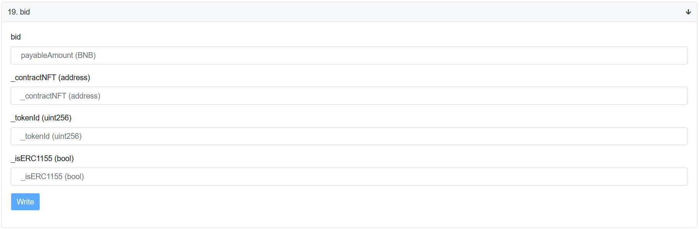
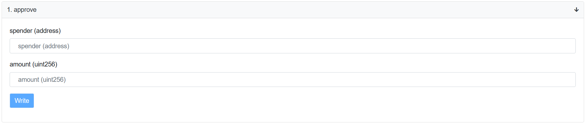
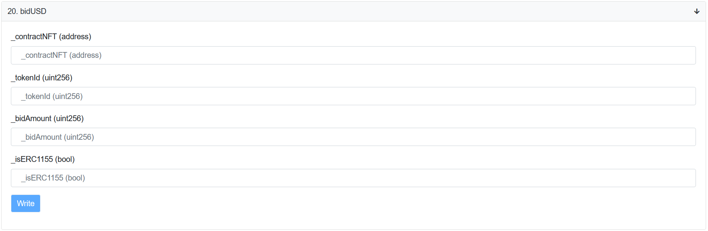
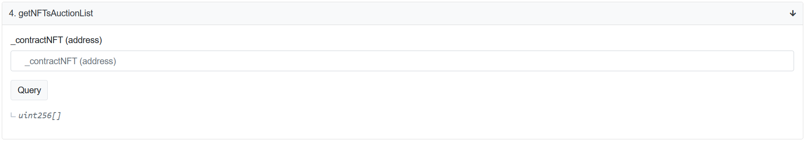
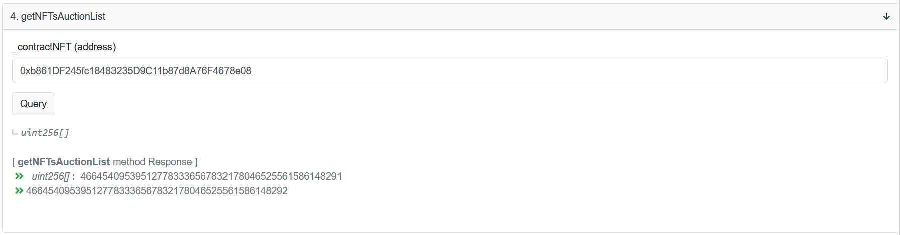
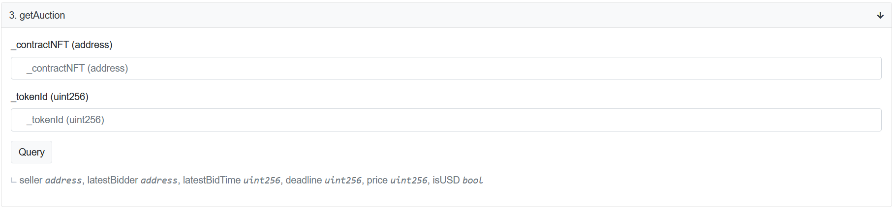
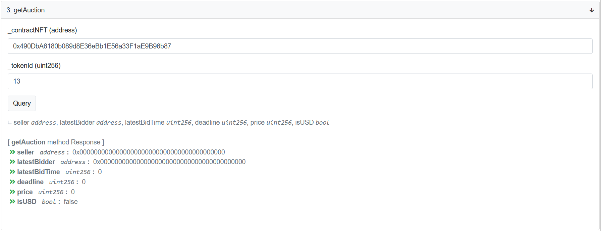

# How to bid on an auction 

The [0x1Bf12f0650d8065fFCE3Cd9111feDEC21deF6825](https://bscscan.com/address/0x1Bf12f0650d8065fFCE3Cd9111feDEC21deF6825#writeContract) offers to you two options to bid on an auction:

* [bid](#bid) (#19) function is used to bid in BNB.
* [bidUSD](#bidusd) (#20) function is used to bid in BUSD tokens.

## bid

* **bid**: Specify an amount (in BNB) you are able to pay for the NFT. Your bid must be higher than the previous bid by one. (`10 * 10 ^ 18`)
>See more on [how to check previous bids](#how-can-i-get-the-auction-details).
* **_contractNFT (address)**: the address of the NFT contract.
* **_tokenId (uint256)**: the Id of the NFT token.
** **_isERC1155 (bool)**: this field shows the token type attribute. If your NFT is ERC1155, set `true`; if not, set `false`.

## bidUSD

To be able to bid in BUSD token, you need to allow the contract to withdraw an amount from your wallet.
For this, open the [0xe9e7cea3dedca5984780bafc599bd69add087d56](https://bscscan.com/address/0xe9e7cea3dedca5984780bafc599bd69add087d56#writeContract) and use the **approve** function:

* **spender (address)**: specify the spender address `0x1Bf12f0650d8065fFCE3Cd9111feDEC21deF6825`.
* **amount (uint256)**: set the amount in BUSD token for your bid.

Once you click **Write**, you can bid on an auction using BUSD tokens. 
Use the **bidUSD** function of [0x1Bf12f0650d8065fFCE3Cd9111feDEC21deF6825](https://bscscan.com/address/0x1Bf12f0650d8065fFCE3Cd9111feDEC21deF6825#writeContract) contract:

* **_contractNFT (address)**: the address of the NFT contract.
* **_tokenId (uint256)**: the Id of the NFT token.
* **_bidAmount (uint256)**: specify an amount (in BUSD token) you are able to pay for the NFT. Your bid must be higher than the previous bid by one (`10 * 10 ^ 18`).
** **_isERC1155 (bool)**: this field shows the token type attribute. If your NFT is ERC1155, set `true`; if not, set `false`.

## How do the bids work?

Once you click **Write** to create a bid, the amount you mentioned will be withdrawn from your wallet. When the auction expires if your bid wins, the NFT contract automatically transfers to your wallet. If someone overbid you, the amount of your bid returns to your wallet.

If the auction is canceled, the amount of your bid returns to your wallet.

## How can I get the NFT auction List?

To find out all active NFT auction list, use the **getNFTsAuctionList** function (#4) of the [0x1c2b69833967500042d476B1149D4074B59c1A17](https://bscscan.com/address/0x1c2b69833967500042d476B1149D4074B59c1A17#readContract):

* **_contractNFT (address)**: the address of the NFT contract for which you want to list all the active auctions.

Once you put the NFT contract address and click the **Query** button, you should see the list of active auctions like shown below:

## How can I get the auction details?

To get the auction details, use the **getAuction** function (#3) of the [0x1c2b69833967500042d476B1149D4074B59c1A17](https://bscscan.com/address/0x1c2b69833967500042d476B1149D4074B59c1A17#readContract):

* **_contractNFT (address)**: the address of the NFT contract.
* **_tokenId (uint256)**: the Id of the NFT token.

Click **Query** to see details like shown below:

