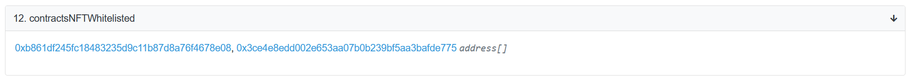
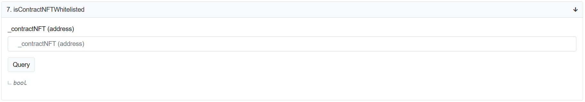
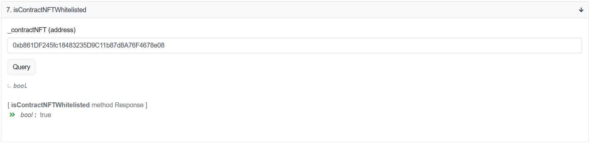
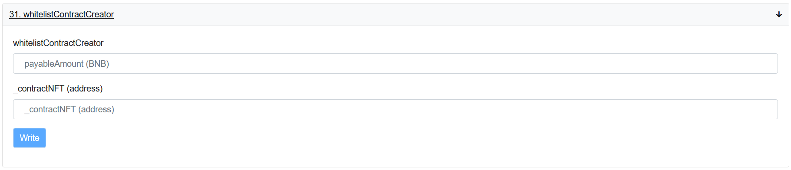
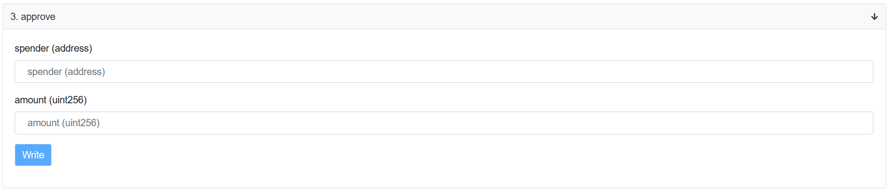
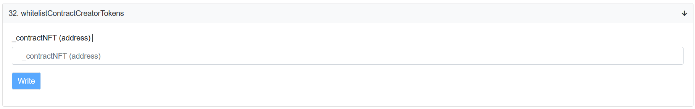

## How to whitelist your NFT contract

Once you mint an NFT, you probably want to list it for auction. To do this, you need to whitelist the NFT contract first.

> **Important:** Your NFT contract is whitelisted by default, if you minted NFT using the [0xb861DF245fc18483235D9C11b87d8A76F4678e08](https://bscscan.com/address/0xb861DF245fc18483235D9C11b87d8A76F4678e08#writeContract) contract.
>
>Read more on [how to mint your NFT using Open Be Sea](./../openBiSea-how-to-mint-nft.md).

## Check the contract whitelisting

You need to check whether your contract has already been whitelisted or not. There are two contracts where you can do this:

1. [0x1Bf12f0650d8065fFCE3Cd9111feDEC21deF6825](https://bscscan.com/address/0x1Bf12f0650d8065fFCE3Cd9111feDEC21deF6825#readContract)  
Use the **contractsNFTWhitelisted** *(#12)* function:  
  
This function shows an array of all the whitelisted NFT contracts. If NFT contract address is in this list, you can skip the whitelisting step and switch to [putting up an NFT token to auction](./openBeSea-NFT-how-to-create-auction.md).  
If you cannot find NFT contract address in the list, please read below on [how to whitelist the NFT contract](#whitelist-the-nft-contract).  
2. [0x1c2b69833967500042d476B1149D4074B59c1A17](https://bscscan.com/address/0x1c2b69833967500042d476B1149D4074B59c1A17#readContract)  
Use the **isContractNFTWhitelisted** function *(#7)*. Put the NFT contract address you want to check in the **_contractNFT (address)** field.  
  
The results should be like shown below:  

## Whitelist the NFT contract

To whitelist the contract, you can use two functions of [0x1Bf12f0650d8065fFCE3Cd9111feDEC21deF6825](https://bscscan.com/address/0x1Bf12f0650d8065fFCE3Cd9111feDEC21deF6825#writeContract) contract: 

1. [whitelistContractCreator](#whitelistcontractcreator-function) *(#31)* - to whitelist NFT token in BNB.

OR

2. [whitelistContractCreatorTokens](#whitelistContractcreatortokens-function) *(#32)* - to whitelist NFT token in OBS tokens.

### whitelistContractCreator function

* **whitelistContractCreator**: specify the payable amount in BNB. The current default value should be *0.0888*
* **_contractNFT (address)**: the NFT contract address (e.g., `0x3ce4e8edd002e653aa07b0b239bf5aa3bafde775`)
* Click **Write**. 

### whitelistContractCreatorTokens function

Choose this function to use OBS tokens to whitelist the NFT contract.

To pay using OBS tokens, you need to allow the contract to withdraw money from your wallet. For this, open [0x490DbA6180b089d8E36eBb1E56a33F1aE9B96b87](https://bscscan.com/address/0x490DbA6180b089d8E36eBb1E56a33F1aE9B96b87#writeContract) contract and use the **approve** *(#3)* function.

* **spender (address)**: specify the following address `0x1Bf12f0650d8065fFCE3Cd9111feDEC21deF6825`.
* **amount (uint256)**: set `10` as a current default value.
>To get the final amount, use `10 * 10 ^ 18`
* Click **Write**. 

Then open the [whitelistContractCreatorTokens](https://bscscan.com/address/0x1Bf12f0650d8065fFCE3Cd9111feDEC21deF6825#writeContract) function *(#32)* in `0x1Bf12f0650d8065fFCE3Cd9111feDEC21deF6825` contract.

> You need to pay 10 OBS tokens to whitelist the contract.

* **_contractNFT (address)**: the NFT contract address (e.g., `0x490DbA6180b089d8E36eBb1E56a33F1aE9B96b87`).
* Click **Write**.

---- 

Once your contract is whitelisted, the contract address will appear in the array provided by the **contractsNFTWhitelisted** *(#12)* function of [0x1Bf12f0650d8065fFCE3Cd9111feDEC21deF6825](https://bscscan.com/address/0x1Bf12f0650d8065fFCE3Cd9111feDEC21deF6825#readContract) contract. 

Now you can [put up the NFT token to auction](./openBeSea-NFT-how-to-create-auction.md).