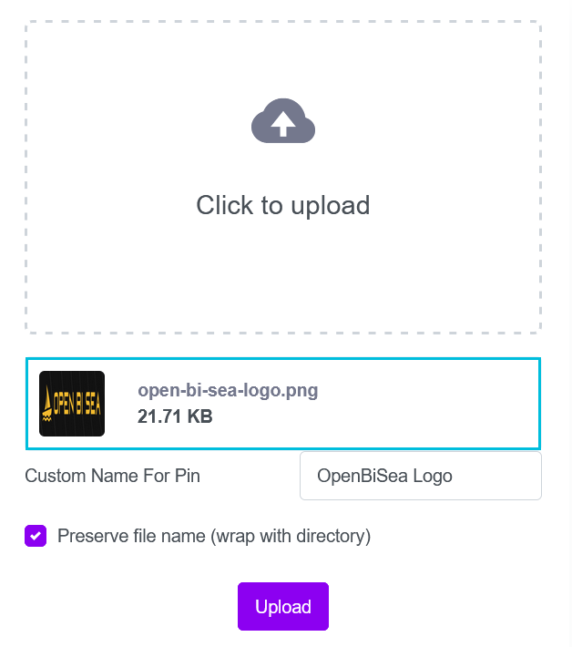

#  NFT User Guide: How to mint and collect unique digital assets (NFT)

This article shows how to mint NFT from scratch using the [Open Bi Sea](https://openbisea.io/) platform and [MetaMask](https://metamask.io/). These platforms allow creators to easily and without permission create their own [NFTs](https://en.wikipedia.org/wiki/Non-fungible_token). 

To mint your first NFT, you need to [create an Ethereum wallet](#creating-and-configuring-a-wallet) and [buy the first BNB](#buy-your-first-bnb), [updload and prepare your unique digital asset](#post-ipfs-asset--json), and, finally, [connect your wallet](#connect-your-wallet) and [write a mint contract](#mint-nft).

## Creating and configuring a wallet

To mint NFT, you need to have a wallet. This article will use MetaMask as an open-source Ethereum wallet that supports all kinds of Ethereum-based tokens (such as those following the ERC-20 standard, or non-fungible tokens). 

### Install MetaMask

MetaMask can be installed on Google Chrome, Firefox, or the Brave Browser. It’s also available on iOS and Android.

1. Open the official download page on [metamask.io](https://openbisea.io/). 
2. Select your browser (We’re going to use Firefox throughout this tutorial).

3. Click on the **Install MetaMask for Firefox** button.
4. Add the extension to your platform. 

**Note:** You may need to grant it some permissions before it’s up and running.
The MetaMask quick access icon appears in your browser window.

5. Click on **Get Started**. This is where you’ll be prompted to either import a seed phrase or create a new one. 
6. Click on **Create a Wallet**.

7. Accept the policy.
8. Create your password.


### Backup your wallet

DO NOT SKIP THIS STEP!

MetaMask is a non-custodial service, meaning that no one else can access your funds. Your tokens exist in a sort of encrypted vault within your browser, protected by your password. That means that if your computer is lost, stolen, or destroyed, nobody can help you recover the wallet. 

So, it’s crucial that you write down your backup phrase. This is the only way you can restore your account should something unfortunate happen. 


Click on the grey box to reveal the phrase. As suggested, we recommend that you write the words down and store them in two or three different locations. You'll be asked to confirm this phrase on the next step.

Click **Next**. Confirm the phrase, then proceed to the next step. Hit **All Done**, and you’ll see the wallet interface.

You should now see your wallet, ready to send and receive funds.


### Configure the wallet

Once you have created a wallet, you see that it is an Ethereum wallet. 
An Ethereum wallet is always created by default. 

To point your wallet towards Binance Smart Chain nodes, you need to access the **Settings**.

1. Select **Settings** from the dropdown menu.

2. Open the **Network** tab from the menu.

3. Click on the **Add Network** in the top-right corner to manually add the Binance Smart Chain one.

**Mainnet**

* Network Name: Smart Chain
* New RPC URL: [https://bsc-dataseed.binance.org/](https://bsc-dataseed.binance.org/)
* ChainID: 56
* Symbol: BNB
* Block Explorer URL: [https://bscscan.com](https://bscscan.com)

Once you Save the Network and return to the main view, you’ll notice two things: the network has automatically been set to the one you just entered, and the units are no longer denominated in ETH, but in BNB.


## Buy your first BNB

You need to buy BNB to your wallet. 

The easiest way to by BNB with a bank card is to open the [https://openbisea.io/buybnb-stripe?wallet=](https://openbisea.io/buybnb-stripe?wallet=) link.

To connect your wallet: 

1. Open your wallet and click on the **Account 1** to copy the wallet address.

2. Open the URL `https://openbisea.io/buybnb-stripe?wallet=<your-wallet-address>` in a new tab and replace `<your-wallet-address>` with the wallet address you got from the previous step.
The link should be like this: `https://openbisea.io/buybnb-stripe?wallet=0xAD82#######################cF73De2d7173d`


Now you can buy your first BNB. For this:

1. Click **Buy Now**.
2. Input amount (by default it is set to 5$). 
3. Enter your email address.
4. Specify the card details.
3. Press **Buy**. 


Your wallet will be updated within 24 hours.

## Post IPFS Asset & JSON

To mint your first NFT, you need to add your asset to IPFS and create a JSON file to get an IPFS hash.

We’re going to use [Pinata](https://pinata.cloud/) to add our asset to IPFS and ensure that it remains pinned. We will also add our JSON metadata to IPFS so that we can pass it through to the token contract. 

Using Pinata, we can leverage content addressability to prove the authenticity of a digital asset. When the asset is created, it can be added to the IPFS network. In doing so, a content identifier (CID) is generated. That identifier is unique to that asset. If someone had a copy of the assets and made a slight modification, the CID would change and anyone in the world would be able to see that the copy was not the original and thus (maybe) not as valuable.

### Upload Your Asset to IPFS 

To upload your asset (e.g., your image), log into the Pinata account. 


Simply go to the Pin Manager, click the upload button, choose file, and upload your file. 



When the upload is complete, you'll see your file in the grid and can copy the **IPFS CID** (the string of characters that starts with "Qm"). You'll need this CID later, so keep it handy. You can also come back to the Pin Manage page and copy it again any time.


### Create and Upload a JSON Metadata File

While the asset is what you are selling, the blockchain that you mint your token on needs to store a "pointer" to that asset. This pointer takes the form of a JSON file with properties that relate to your NFT. Think of these properties as rows and columns in a spreadsheet. You might have a row called "Name" and in the associated column, you might have "John Doe". That is essentially what a JSON file is doing.

Let's take a look at a very basic example of some JSON specifically designed for NFT metadata:

```
{
  "description": "Description of your NFT", 
  "image": "ipfs://YOUR_ASSET_CID", 
  "name": "A name for your NFT"
}
```

Example:

```
{
    "name":"The Open Bi Sea Logo",
    "description":"A logo of the auction in a SAFU all-in-one place to cut any NFT deal in a few clicks. Mobile, decentralized, blockchain-based.",
    "animation_url":"ipfs://QmRYmCk1v5sVdC785Hn23hpQUJDgZozdxiQm4FC4DQYQLn"
}
```

You can add any other properties you want in way like shown bellow:

```
{
    "name":"The Dogefather",
    "description":"A tribute to the Dogefather and the future Imperator of Mars! The first piece of the new #CryptoLeaders Laffpro AI art series exclusively for the bakeryswap NFT platform.", 
    "properties":
        {
            "cover_url":"",
            "artist":"Laffpro",
            "public_profile_link":"https://linktr.ee/laffpro"
        },
    "animation_url":"ipfs://YOUR_ASSET_CID"
}
```

The image property is especially important because this is the actual pointer we mentioned before. It points to your asset which is hosted on IPFS.

### How to create a JSON file

Creating your JSON file is pretty simple. Open up the notepad app on your computer, copy the JSON example from above, and paste it into the notepad. Change the values however you need to, but make sure both the properties and the values are wrapped in double quotes.

Save your file and give it a useful name like `asset_metadata.json`. You can call it whatever you'd like, but you need to make sure to save it with the `.json` file extension.

Now, you can upload this JSON to Pinata. When you do, you will once again get a CID. This time, the CID is for your metadata JSON which is a pointer to the file you uploaded before.


Once the JSON file is uploaded, you'll see the following:


### How To Associate Metadata With Your NFT

When you mint your token, most platforms will ask for this metadata. You should be able to provide the metadata in the same format as you did for your asset value in the metadata itself:

`ipfs://YOUR_METADATA_CID`

Now you have a future proof NFT that you can hold, transfer, or sell. Anyone can fetch the asset you created without needing to worry about any specific service existing in the future.

## Connect your Wallet

To mint your NFT, do the following:

1. Open the [https://bscscan.com/address/0xb861DF245fc18483235D9C11b87d8A76F4678e08#writeContract](https://bscscan.com/address/0xb861DF245fc18483235D9C11b87d8A76F4678e08#writeContract) link.
2. Click on the **Connect to Web3** link.

3. Select your wallet. 

4. Click **Next** and **Connect**.

Now, your wallet is connected:


## Mint NFT

To mint your NFT, you need to write the `mint` contract. For this, fill in the following fields:


Where:

* **to (address)** - is the address of your wallet
* **tokenURI (String)** - is the `ipfs` address of youe media asset JSON.

*How to link to content on IPFS:*

`https://ipfs.io/ipfs/<CID>`

For example:

`https://ipfs.io/ipfs/Qme7ss3ARVgxv6rXqVPiikMJ8u2NLgmgszg13pYrDKEoiu`


You have to confirem transaction:


You will see the confirmation popup window:


You always can see the transaction details:


If you open your Metamask wallet, you'll see your mint NFT in the **Activity** tab:


Click the Mint to see details:


